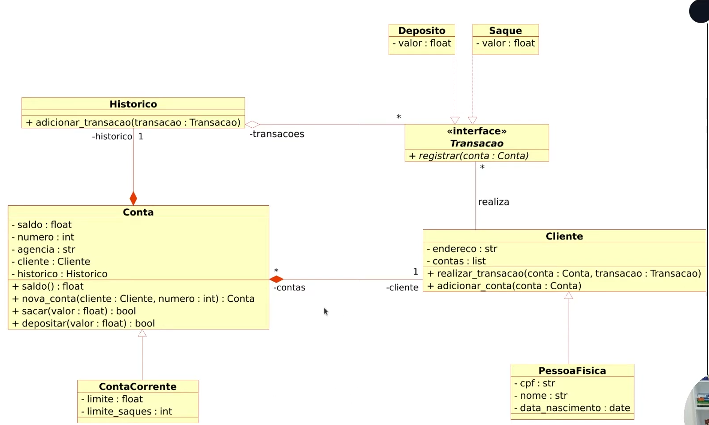

# Desafio: Criando um sistema bancário

## Objetivo Geral
Criar um sistema bancário com as operações: **sacar**, **depositar** e **visualizar extrato**

## Desafio
Fomos contratados por um grande banco para desenvolver o seu novo sistema. Esse banco deseja modernizar suas operacões e para isso escolheu a linguagem Python. Para a primeira versao do sistema devemos implementar apenas 3 operações: depósito, saque e extrato.

### Depósito
Deve ser possível depositar valores positivos para a minha conta bancaria. A v1 do projeto trabalha apenas com 1 usuário, dessa forma nao precisamos nos preocupar em identificar qual é o número da agência e conta bancária. Todos os depósitos devem ser armazenados em uma variavel e exibidos na operação de extrato.

### Saque
O sistema deve permitir realizar **3 saques diarios** com limite máximo de `R$ 500,00` por saque. Caso o usuário não tenha saldo em conta, o sistema deve exibir uma mensagem informando que nao sera possível sacar o dinheiro por falta de saldo. Todos os saques devem ser armazenados em uma variável e exibidos na operação de extrato.

### Extrato
Essa operação deve listar todos os depósitos e saques realizados na conta. No fim da listagem deve ser exibido o saldo atual da conta. Se o extrato estiver em branco, exibir a mensagem: `Não foram realizadas movimentações.`

Os valores devem ser exibidos utilizando o formato `R$ xxx.xx`, exemplo:

`1500.45` → `R$ 1500.45`

## Desafio 02
Precisamos deixar nosso código mais modularizado, para isso vamos criar funções para as operações já existentes: **sacar**, **depositar** e **visualizar histórico**. Além disso, para a versão 2 do nosso sistema precisamos criar duas novas funções: **criar usuário** (cliente do banco) e **criar conta corrente** (vincular com usuário).

## Desafio POO parte 01
### Objtivo Geral
Iniciar a modelagem do sistema bancário em POO. Adicionar classes para **cliente** e as operações bancárias: **depósito** e **saque**.

### Desafio
Atualizar a implementação do sistema bancário, para armazenar os dados de clientes e contas bancárias em objetos ao invés de dicionários. O código deve seguir o modelo de classes UML a seguir:
